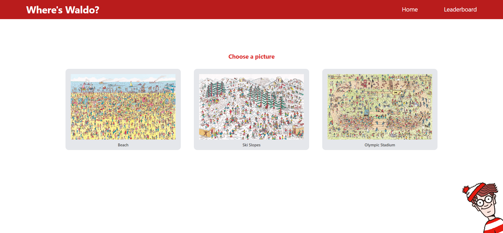
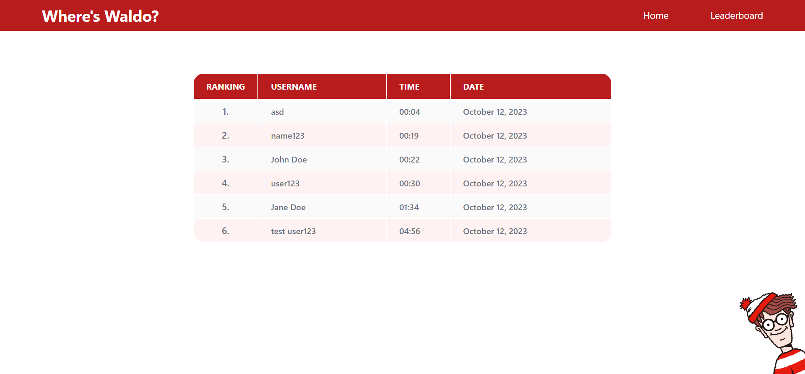

# Where's Waldo?

Deployed app: https://tourmaline-twilight-0f12d8.netlify.app/

- You might need to wait for a few seconds to backend to boot-up for everything to work properly (cause its free option)

## Description

This application simulates the popular puzzle game "Where's Waldo?", where the user is trying to find specific characters in a picture among dozens of people. Upon completion, a user can save their time with a name into a database.

This application is part of the Odin Project's React course. Exercise link: https://www.theodinproject.com/lessons/react-new-where-s-waldo-a-photo-tagging-app

## Technologies

- Rails
- Vite
- React
- React router
- Tailwind CSS

## How this app works

User can select an image, where he needs to find 5 characters to complete the game. After image is loaded, a timer starts which measures time needed for the player to find all characters. Displayed frontend timer is done with react, but on completion time is checked on backend, from the session which is created after loading React component. This prevents the user from "hacking" their time.
Checking character's position is also done on backend.
After finding all characters, a user's time and name can be saved to a leaderboard on the backend.

## Images

